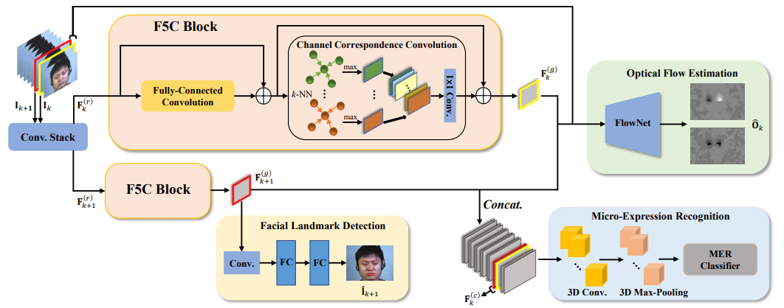

# MOL
This repository is the PyTorch implementation of "MOL: Joint Estimation of Micro-Expression, Optical Flow, and Landmark via Transformer-Graph-Style Convolution".

### Overview


### Datasets
Data preparation: The datasets like [CASME II](http://casme.psych.ac.cn/casme/c2), [SAMM](https://helward.mmu.ac.uk/STAFF/M.Yap/dataset.php), and [SMIC](https://www.oulu.fi/en/university/faculties-and-units/faculty-information-technology-and-electrical-engineering/center-for-machine-vision-and-signal-analysis) should follow such folder structure.

```
│data/
├──CASME2_data_5/
│  ├── disgust
│  │   ├── 01_EP19_05f
│  │   │   ├── img1.jpg
│  │   │   ├── img2.jpg
│  │   │   ├── ......
│  ├── surprise
│  │   ├── ......

├──SAMM_data_5/
│  ├── anger
│  │   ├── 006_1_2
│  │   │   ├── 006_05562.jpg
│  │   │   ├── 006_05563.jpg
│  │   │   ├── ......
│  ├── contempt
│  │   ├── ......

├──SMIC_data_3/
│  ├── surprise
│  │   ├── s9_sur_03
│  │   │   ├── image090823.jpg
│  │   │   ├── image090824.jpg
│  │   │   ├── ......
│  ├── negative
│  │   ├── ......

|......
```
### Requirement
```
dlib==19.24.1
numpy==1.23.5
opencv_contrib_python_headless==4.7.0.72
opencv_python==4.7.0.72
opencv_python_headless==4.7.0.72
Pillow==9.5.0
scikit_learn==1.2.2
spatial_correlation_sampler==0.4.0
torch==1.13.0+cu116
torchsummary==1.5.1
torchvision==0.14.0+cu116
```

###Preparation
1. Download [Dlib 68_landmarks predictor weight](http://dlib.net/files/shape_predictor_68_face_landmarks.dat.bz2) to ./utils
2. Run 'dataset.py' to make training and testing dataset.
```
python dataset.py -- dataset SAMM --class_num 5 
```

### Train & Evaluate
Run 'main.py' to train and evaluate the model.
```
python main.py --lr 1e-4 --num_steps 1000 --batch_size 32 --of_weight 0.5 --ldm_weight 0.5 --neighbor_num 4 --save_path saved_model/ --version V1.0 --seed 2024 -- dataset SAMM --class_num 5 
```

### Test
Run 'test.py' to test.
```
python test.py --model_path saved_model/V1.0.pth --output_path output/ 
```
